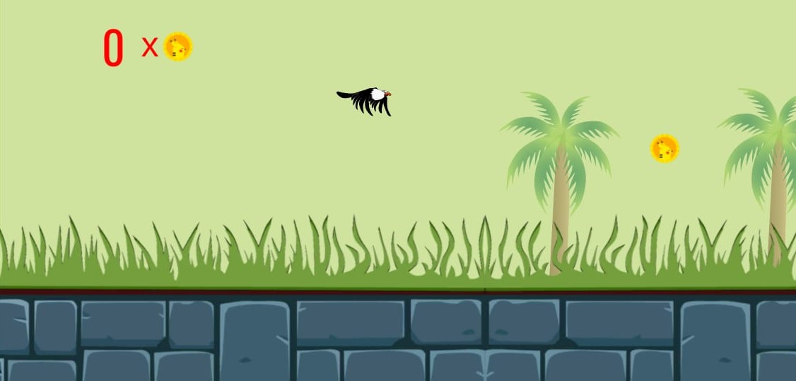
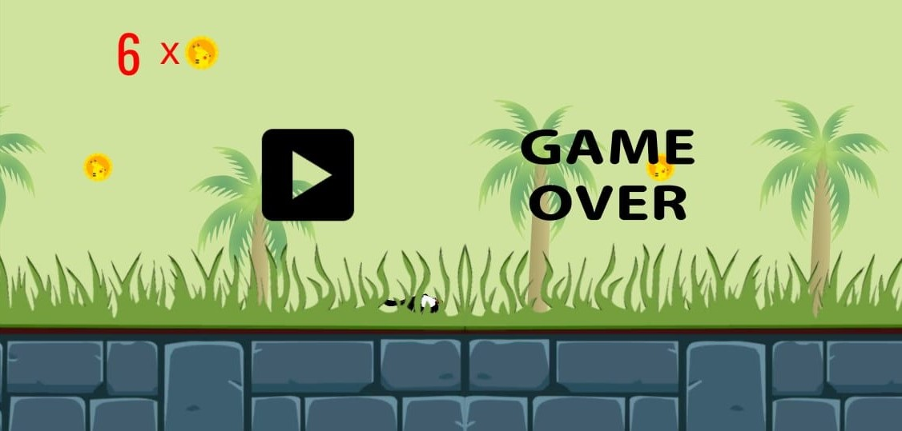

# FlappyEagle
FlappyEagle is a Flappy Bird Clone made on Unity engine. I took up this project to increase familiarity with the Unity Engine and C# language. The game is intended to be played at FHD(1920x1080) resolution and is fully compatible with notch screen devices i.e. rendering is done outside the safe area to support notch screen devices.
 
# link to APK file of the build: https://github.com/SKY-ROY/FlappyEagle/raw/master/Builds/Android/FlappyEagle(0.2).apk
# link to WebGL version of the build: https://simmer.io/@FUNAMBIGUATION/flappyeagle

# NOTE
All the files present in this github repository(other than the "Builds" folder) are sufficient to clone the project in your target machine, with all the settings matching the parent machine. 
The only folder missing here in this repository is the "library" folder which contains the pre built packages and settings by Unity. 
When you load the folder with all contents of this repository("Builds" folder not necessary) as a project in Unity, Unity will generate the "library" folder itself to clone the project with parent machine's settings. 

# screenshots
 

